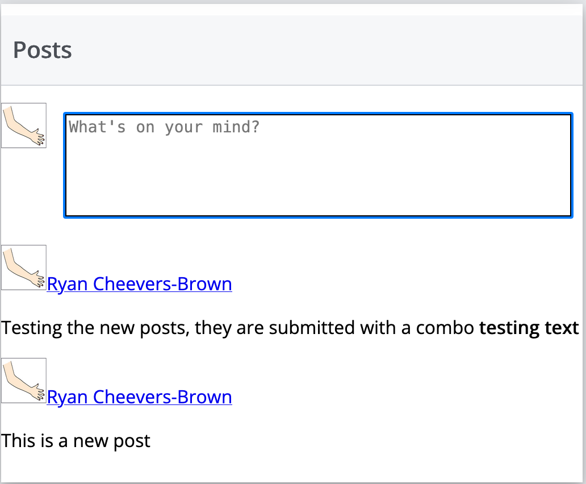
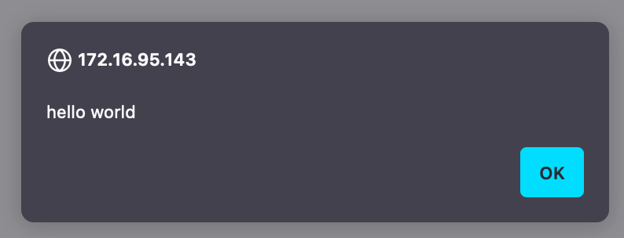
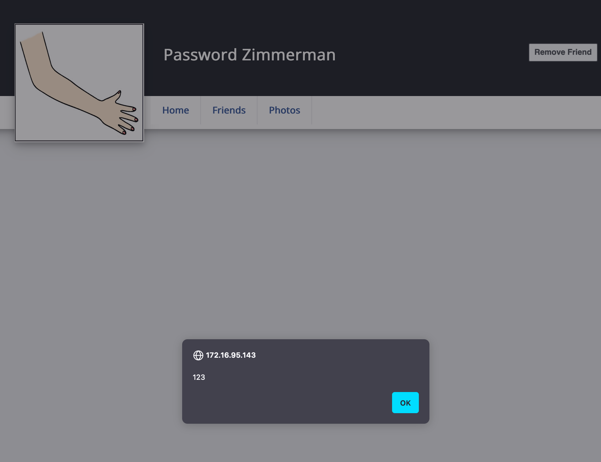
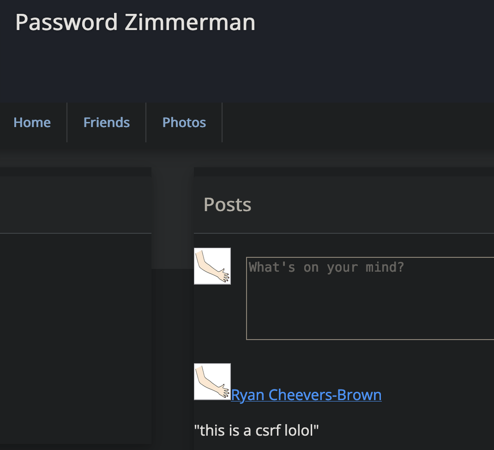
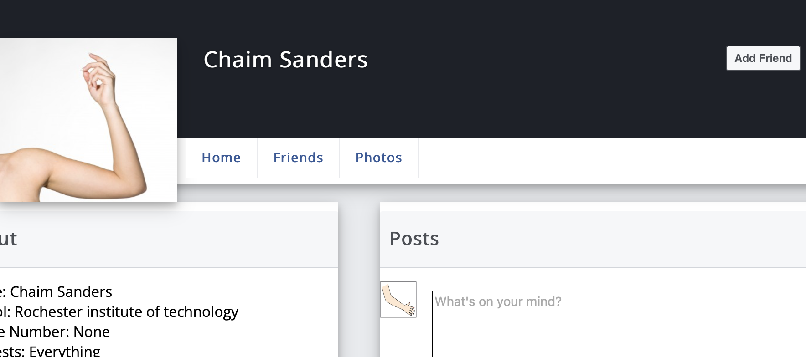
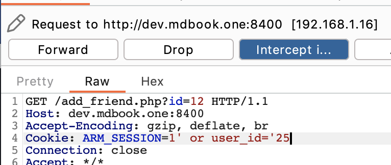
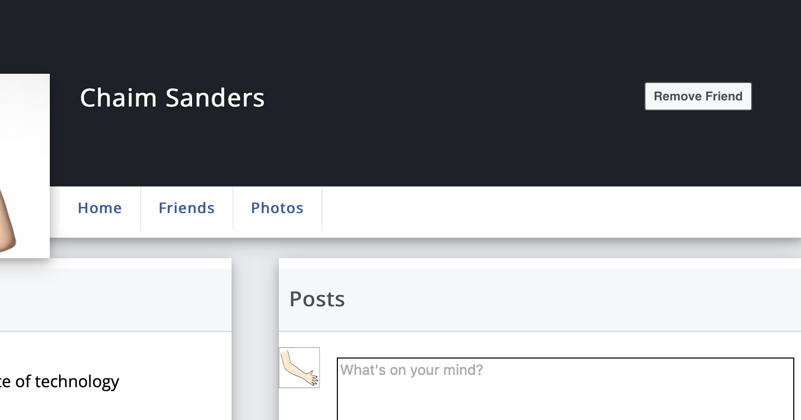

# Web Application Security Practical Final

## Armbook Setup

I've installed Armbook and made a profile for myself. 


## Armbook Security Testing

### XSS - Timeline

I began timeline testing the way I always do, by inserting HTML-formatted characters using the `<b>` and `</b>` tags. 



#### Replication Steps

Next, I'll test an alert. Developers, use the following payload on *any* timeline to see that the field is indeed vulnerable to JS injection. 

```html
testing.
<script> alert("hello world")</script>
```



#### Impact

When I reload the page, the alert spawns again. That means that this injected javascript is saved in the database and will affect anybody who visits my timeline. Anybody who has an account on the site can steal session cookies or other browser information from *anybody* who visits their timeline. 

This vulnerability applies to all timelines. I was able to do this injection on Password Zimmerman's timeline. 



#### Code Discovery Process

In the below code, the text box that says `"What's on your mind?"` is created with the ID `statupdate`. This text box then waits on a `document.ready` loop for the press of an enter key (ID 13) when it then sends the comment in with a GET parameter to the page `add_comment.php`. The target user's ID is sent in the `id=` parameter, and the comment is sent in the `comment=` parameter. 

```php
<textarea id="statupdate" placeholder="What's on your mind?"></textarea>

<script>
$( document ).ready(function() {
    $('statupdate').keypress( function (e) {
        if ( e.which == 13 ) {
            $.get( "add_comment.php?id=<?php echo $id_to_get; ?>&comment="+$('#statupdate').val(), function( data ) { location.reload(); 
            });
        return false;
        }
    });
});
</script>
```

Investigating the workflow on the `add_comment.php` page reveals that there is no sanitization on the input, comments are truncated to 300 characters, and there is not an easy SQL injection vulnerability present as the SQL is all via prepared query. 

```php
if( isset( $_GET['comment'])) {
    $maxlength = 300;
    $comment = $_GET['comment'];
    $comment = substr( $comment, 0, $maxlength );
    $stmt = $mysqli->prepare( "INSERT INTO posts (user_id_from, user_id_to, text) VALUES (?, ?, ?)" )
    if ( $stmt->bind_param( "iis", $real_user, $id_to_get, $comment )){
        $stmt->execute()
    }
}
```

#### Mitigation

My suggested mitigation would replace

```php
$comment = $_GET['comment'];
```

with

```php
$comment = htmlspecialchars( $_GET['comment'] );
```

This should prevent any HTML or JS code sent in the `comments` parameter from executing, as it would all be converted to plain text. 

#### OWASP Top 10

This vulnerability likely sits under the 'injection' category of the OWASP top 10 vulnerabilities. 

#### CVSS Information

Base Score: 8.1

String: `CVSS:3.1/AV:N/AC:L/PR:L/UI:N/S:U/C:H/I:H/A:N`

#### Risk

I would put this vulnerability at a critical. It is easily exploitable over the internet, requires no special permissions, can give complete access to user or administrator accounts via session cookie theft, and should be fixable sitewide with one line of code. 

___________________

### CSRF - Home Page

A Client-Side Request Forgery is a type of attack where the user clicks on a maliciously-crafted link, and an action the attacker wants executes with out consent of the victim. Putting the following link into an email, hiding it with link text, and sending it to the user. Once the the user is logged in and clicks the link, the comment that the attacker chooses will be posted. 

#### Replication Steps

Paste this link into the browser when logged in to replicate the attack. This will work as-is on my VPN. It adds a comment to Password Zimmerman's timeline that says `"This is a CSRF lolol"`. 

```php
http://10.0.1.107/add_comment.php?id=2&comment="this%20is%20a%20csrf%20lolol"
```


#### Impact

This allows an attacker to post comments as any user they want, provided they can send a link and/or social engineer the user. The attacker could craft a payload to send session cookies of anyone who visits the link via the XSS vulnerability in part 1. 

#### Code Discovery

There is no mention of anti-CSRF tokens in `home.php` which is what would be necessary to mitigate this vulnerability. 

#### Mitigation

The appropriate mitigation for this vulnerability is the addition of anti-CSRF tokens. These tokens should be single-use and updated each time the user refreshes or reloads a page. 

This code checks to see if the correct anti-CSRF token was submitted:

```php
checkToken( $_REQUEST[ 'user_token' ], $_SESSION[ 'session_token' ], 'index.php' );
```
This code generates an anti-CSRF token. 

```php
generateSessionToken();
header ( "Content-Type: application/json" );
print json_encode( array( "Message" => $return_message ));
```

If this code were implemented, the code above that posts the 'lol csrf' comment would not work, as the user would be directly visiting the `add_comment.php` page without first getting one of these tokens from another page. 

#### OWASP Top 10

This vulnerability sits in the Broken Access Control in the 2021 OWASP Top 10 vulnerability classes matrix. 

#### CVSS Information

Base Score: 9.3

String: `CVSS:3.1/AV:N/AC:L/PR:N/UI:R/S:C/C:L/I:H/A:N`

I am torn between low and high for confidentiality. By itself, this vulnerability is not a 'high' for confidentiality impact. However, when paired with the XSS vulnerability, this allows the attacker to grab session cookies by the dozen. 

#### Risk

The risk of this vulnerability is critical. It's very easy to exploit, and relatively easy to fix. When paired with the XSS vulnerability, an attacker could feasibly grab *most* of the active session cookies of an active instance of this application. 

________________

### SQL Injection - Add Friends

This site has an SQL injection in the `add_friends` page. It allows an SQL injection via the session cookie. 

#### Replication Steps

Using Burp Suite, turn proxy interception on, then click the "add friend" button with a person you aren't friends with. I started while not being friends with Chaim Sanders. 



Then I sent a friend request to him and intercepted it. 



The injectable field is the cookie field. My payload is listed to the left. The payload matches my user ID which is 25 as multiple accounts were made on this instance of Armbook. A generified payload looks like this. 

```sql
1' or user_id='<your user ID>
```

Once added to the query in the PHP code, it combines to form this query:

```sql
SELECT * from sessions where session_id='1' or user_id='25';
```

It will always return true when your user ID is correct. If the SQL wasn't executing, I should not become friends with Chaim Sanders. However, I immediately became friends with Chaim. This means that the SQL injection worked, and I can run any SQL query I want in this field. 



#### Impact

The web application's database could be destroyed with a well-placed `DROP TABLE` query, or user information gathered with some clever blind injection scripting. This is primarily an availablility vulnerability. 

#### Code Discovery

In the code, we can see that the SQL query is generated with a straight string concatentation and not a prepared query. 

```php
$session_id = $_COOKIE["ARM_SESSION"];
$stmt = "SELECT * from sessions where session_id='" . $session_id . "'";
$result = $mysqli->query($stmt);
$row = $result->fetch_assoc();
```

This makes it very likely to be injectable unless a lot of other sanitization is happening before the variables are concatenated. That's not happening in this code. 

#### Mitigation

This can be mitigated with a prepared query. 

```php
$stmt = $mysqli->prepare("SELECT * from sessions where session_id=?")
$stmt->bind_param("s", $session_id)
$stmt->execute()
```

#### OWASP Top 10

This vulnerability is part of A03: Injection in the 2021 OWASP Top 10 vulnerability classes matrix. 

#### CVSS Information

Base Score: 8.5

String: `CVSS:3.1/AV:N/AC:H/PR:L/UI:N/S:C/C:H/I:H/A:H`

#### Risk

The primary risk here is to availability. Injecting a `DROP DATABASE` would cause the immediate destruction of most of the web application. The injection could also be used to get data on users or other confidential information, though that would take a bit more concerted effort and potentially some blind injection scripting. 

## Automated Web Scanning 

### Which OWASP ZAP finding is the most significant and why?

The Path traversal finding is the most significant. It's not an actual path traversal. 

ZAP Changes the "ARM_SESSION" parameter to "login.php" from the actual session token and the login still succeeded. This likely means that the session token is settable by the user. I tested this with all "0" characters in this parameter and even that worked! Then the string of 0's became my session token. 

This is significant because an attacker could use this vulnerability to force session tokens and gain access to user accounts. 

### Are any of the high-priority findings likely to be false positives? If so, why?

The path traversal finding is technically a false positive. No path traversal was found. However, that alert does indicate another vulnerability which is explained above. 

Additionally, the Content Security Policy header alert is a likely false positive. This triggered on the `robots.txt` page, not an actual page of the web site which makes it much more likely to be a false positive. 

### Did it find any of the vulnerabilities in section 2?

ZAP found the anti-CSRF vulnerability. 