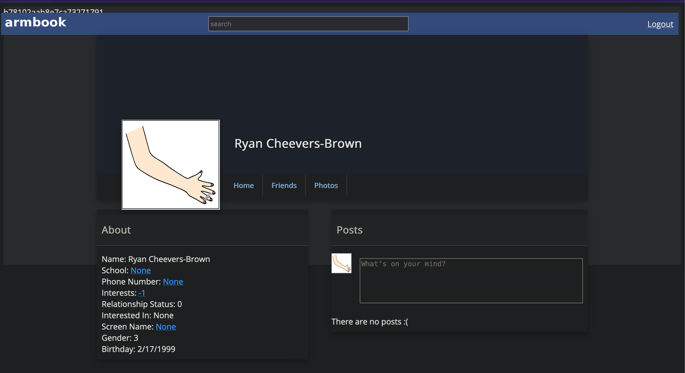

# Web Application Security Practical Final

## Armbook Setup

I've installed Armbook and made a profile for myself. 



## Armbook Security Testing

### XSS - Timeline

I began timeline testing the way I always do, by inserting HTML-formatted characters using the `<b>` and `</b>` tags. 


#### Replication Steps

Next, I'll test an alert. Developers, use the following payload on *any* timeline to see that the field is indeed vulnerable to JS injection. 

```html
testing.
<script> alert("hello world")</script>
```


#### Impact

When I reload the page, the alert spawns again. That means that this injected javascript is saved in the database and will affect anybody who visits my timeline. Anybody who has an account on the site can steal session cookies or other browser information from *anybody* who visits their timeline. 

This vulnerability applies to all timelines. I was able to do this injection on Password Zimmerman's timeline. 


#### Code Discovery Process

In the below code, the text box that says `"What's on your mind?"` is created with the ID `statupdate`. This text box then waits on a `document.ready` loop for the press of an enter key (ID 13) when it then sends the comment in with a GET parameter to the page `add_comment.php`. The target user's ID is sent in the `id=` parameter, and the comment is sent in the `comment=` parameter. 

```php
<textarea id="statupdate" placeholder="What's on your mind?"></textarea>

<script>
$( document ).ready(function() {
    $('statupdate').keypress( function (e) {
        if ( e.which == 13 ) {
            $.get( "add_comment.php?id=<?php echo $id_to_get; ?>&comment="+$('#statupdate').val(), function( data ) { location.reload(); 
            });
        return false;
        }
    });
});
</script>
```

Investigating the workflow on the `add_comment.php` page reveals that there is no sanitization on the input, comments are truncated to 300 characters, and there is not an easy SQL injection vulnerability present as the SQL is all via prepared query. 

```php
if( isset( $_GET['comment'])) {
    $maxlength = 300;
    $comment = $_GET['comment'];
    $comment = substr( $comment, 0, $maxlength );
    $stmt = $mysqli->prepare( "INSERT INTO posts (user_id_from, user_id_to, text) VALUES (?, ?, ?)" )
    if ( $stmt->bind_param( "iis", $real_user, $id_to_get, $comment )){
        $stmt->execute()
    }
}
```

#### Mitigation

My suggested mitigation would replace

```php
$comment = $_GET['comment'];
```

with

```php
$comment = htmlspecialchars( $_GET['comment'] );
```

This should prevent any HTML or JS code sent in the `comments` parameter from executing, as it would all be converted to plain text. 

#### OWASP Top 10

This vulnerability likely sits under the 'injection' category of the OWASP top 10 vulnerabilities. 

#### CVSS Information

Base Score: 8.1

String: `CVSS:3.1/AV:N/AC:L/PR:L/UI:N/S:U/C:H/I:H/A:N`

#### Risk

I would put this vulnerability at a critical. It is easily exploitable over the internet, requires no special permissions, can give complete access to user or administrator accounts via session cookie theft, and should be fixable sitewide with one line of code. 

___________________

### CSRF - Home Page

A Client-Side Request Forgery is a type of attack where the user clicks on a maliciously-crafted link, and an action the attacker wants executes with out consent of the victim. 

#### Replication Steps

#### Impact

#### Code Discovery

#### Mitigation

#### OWASP Top 10

#### CVSS Information

Base Score:

String: ``

#### Risk

________________

### SQL Injection - Add Friends

#### Replication Steps

#### Impact

#### Code Discovery

#### Mitigation

#### OWASP Top 10

#### CVSS Information

Base Score:

String: ``

#### Risk